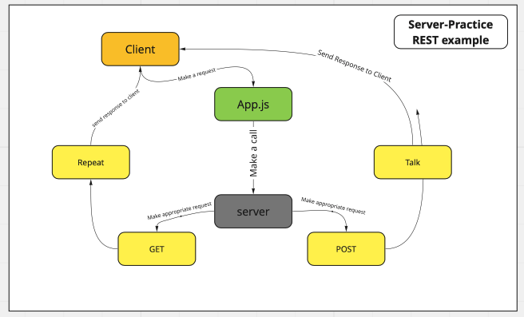

# server-deployment-practice

This is a test server. The idea of this excercise it to get reacquainted with server-side setup and build file-tree setup. Simple GET & POST server requests. Deplopyed Via Heroku.

# Express Server

Created by Jacob Gregor

## Installation

npm install { jest, express, dotenv, supertest}

## Summary of Problem Domain

Review server setup and instalation. What is the appropriate file-tree setup and how to we test server calls to make sure our server is deployed and communicating with requests.

## Links to application deployment

POST: https://server-deployment-test.herokuapp.com/talk?search=hi  
GET: https://server-deployment-test.herokuapp.com/repeat

Heroku: https://server-deployment-test.herokuapp.com
GitHub: https://github.com/Code-Fellows-401/server-deployment-practice

## Embedded UML

## Talk about your routes

Path: /repeat  
responds with the last string used in post route /talk.  
HTTP POST

Path: /talk  
Accepts a string.  
responds with a string in all caps.
